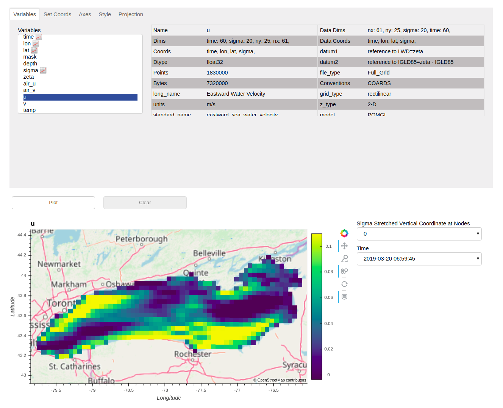

# Explore xrviz

### Instructions
1. Clone the repository and change directory.
   > `git clone https://github.com/hdsingh/explore_xrviz` 

   > `cd explore_xrviz`
2. Create conda environment and activate it.
   > `conda env create -f environment.yml`

   > `conda activate xrviz_env`
3. Run the command
   > `python lakes.py`

To visualise any other Xarray Dataset/DataArray replace `ds = xr.open_dataset('data/great_lakes.nc')` with your own or remote data.
